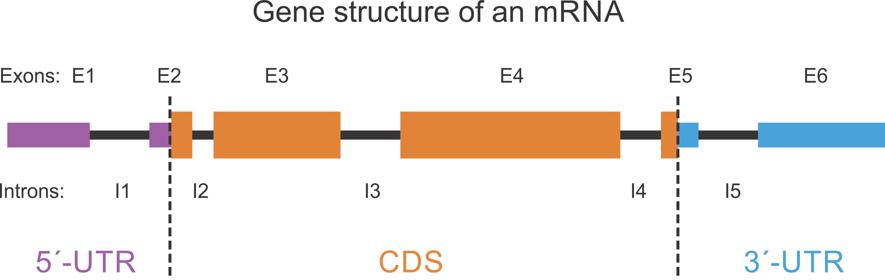

# Bed12Processing
Bash scripts related to bed12 (or bed6, bed2) data processing

## BED12Extractor.sh


This script extracts 5’UTR, 3‘UTR, CDS or intron from a BED12 file

[Usage]: BED12Extractor.sh -a [utr5|cds|utr3|intron] -i [In.bed12] -o [Out.bed12]

[Output]: A new file in bed12 format

```
BED12Extractor.sh -a cds -i data/mm10.mRNA.bed12 -o data/mm10.mRNA.cds.bed12
BED12Extractor.sh -a utr3 -i data/mm10.mRNA.bed12 -o data/mm10.mRNA.utr3.bed12
BED12Extractor.sh -a utr5 -i data/mm10.mRNA.bed12 -o data/mm10.mRNA.utr5.bed12
BED12Extractor.sh -a intron -i data/mm10.mRNA.bed12 -o data/mm10.mRNA.intron.bed12
```
