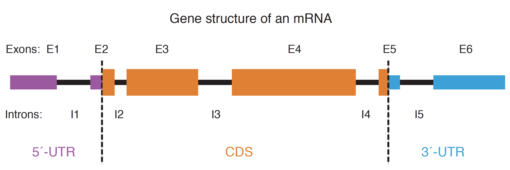
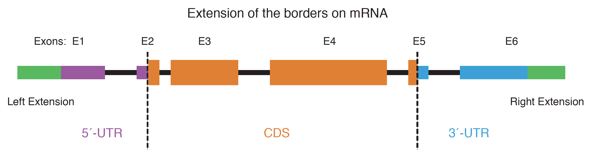
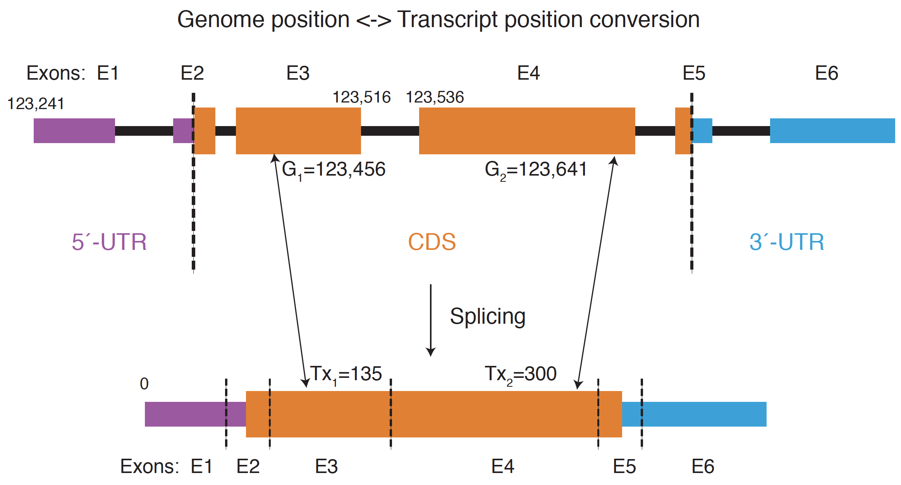

# Bed12Processing
This repository contains a set of Bash and Python3 scripts related to bed12 (or bed3, bed4) data processing

## BED12Extractor.sh


This script extracts 5’UTR, 3‘UTR, CDS or intron from a BED12 file

[Usage]: BED12Extractor.sh -a [utr5|cds|utr3|intron] -i [In.bed12] -o [Out.bed12]

[Output]: A new file in bed12 format

```
BED12Extractor.sh -a cds -i data/mm10.mRNA.bed12 -o data/mm10.mRNA.cds.bed12
BED12Extractor.sh -a utr3 -i data/mm10.mRNA.bed12 -o data/mm10.mRNA.utr3.bed12
BED12Extractor.sh -a utr5 -i data/mm10.mRNA.bed12 -o data/mm10.mRNA.utr5.bed12
BED12Extractor.sh -a intron -i data/mm10.mRNA.bed12 -o data/mm10.mRNA.intron.bed12
```

## BED12FeatureAdder.sh

This script adds a suffix to the end of all names in column 4

This is specially useful after feature extraction since CDS or UTR extracted data keep same transcript names

[Usage]: BED12FeatureAdder.sh [Data.bed12] [Suffix of col4] 

[Output]: The original file will be updated, with suffix added to column 4

```
BED12FeatureAdder.sh data/mm10.mRNA.cds.bed12 cds
```

## BED12LeftRightExtender.py



This script takes bed12 as input, extend column 2 and column 3 borders, and change column 11 and 12 accordingly

[Usage]: [BED12LeftRightExtender.py] [Gene.bed12] [LeftExtension] [RightExtension] [Output.ext.bed12]

[Output]: A new bed12 file

```
python3 BED12LeftRightExtender.py data/mm10.mRNA.bed12 100 200 data/mm10.mRNA.Left100Right200.Ext.bed12
```

## BED12RemoveDupNames.sh

This pipeline takes a bed12 file as input, add _1, _2, ... on column 4, for duplicated col4

[Usage]: BED12RemoveDupNames.sh [Data|File in bed12 format] [OutputName] 

[Output]: A new bed12 file

```
BED12RemoveDupNames.sh data/Demo.WithDup.bed12 data/Demo.NoDup.bed12
```

## BED12TranslateAddORF.sh

This pipeline that takes ORF genomic bed4 (first 4 columns from BED12TranslateTx2GenomePos.sh) as input, and adds ORF information in column 7-8

[Usage]: `basename $0` -i [Genes.bed12] -t [GenomePos.bed4|chr start end TxName] -o [Output.bed12]

[Output]: A bed12 annotation file with new orfs added. The ones that don't have new orfs WON'T be output

```
BED12TranslateAddORF.sh -i data/mm10.mRNA.bed12 -t data/mm10.mRNA.tx.cds.bed12 -o data/mm10.mRNA.ORFAdded.bed12
```

## BED12TranslateGenomePos2Tx.sh



This is a translator of gemomic locations to transcript positions, based on the BED12 annotation

[Usage]: BED12TranslateGenomePos2Tx.sh -i [Genes.bed12] -t [GenomePos.bed4] -o [Tx.bed3|TxName start end]

GenomePos.bed4: Only require the first four columns : chr start end TxName. BED12 input also works

[Output]: 0-based Tx locations, containing only three columns

```
BED12TranslateGenomePos2Tx.sh -i data/mm10.mRNA.bed12 -t data/mm10.mRNA.cds.bed12 -o data/mm10.mRNA.tx
```

## BED12TranslateTx2GenomePos.sh

This is a translator of transcript locations to gemomic locations, based on the BED12 annotation, a reverse of BED12TranslateGenomePos2Tx.sh.

[Usage]: BED12TranslateTx2GenomePos.sh -i [Genes.bed12] -t [Transcript.bed] -o [Output.bed12]

Transcript.bed: Only require the first three columns :TxName start end

[Output]: For each record in the Transcript.bed, corresponding bed12 record will be generated in Output.bed12

```
BED12TranslateTx2GenomePos.sh -i data/mm10.mRNA.bed12 -t data/mm10.mRNA.tx -o data/mm10.mRNA.tx.cds.bed12
```

If you translate ORF positions from Transcript coordinates to Genome coordinates using BED12TranslateTx2GenomePos.sh, it will be same as extracting CDS from the original BED12:

```
BED12Extractor.sh -a cds -i gene.bed12 -o gene.cds.bed12
BED12TranslateGenomePos2Tx.sh -i gene.bed12 -t gene.cds.bed12 -o gene.cds.tx
BED12TranslateTx2GenomePos.sh -i gene.bed12 -t gene.cds.tx -o gene.cds.bed12.validate
```
gene.cds.bed12.validate will be same as gene.cds.bed12

Those scripts have been used in the following publication:

Sun, Y.H., Zhu, J., Xie, L.H. et al. Ribosomes guide pachytene piRNA formation on long intergenic piRNA precursors. Nat Cell Biol 22, 200–212 (2020). https://doi.org/10.1038/s41556-019-0457-4
